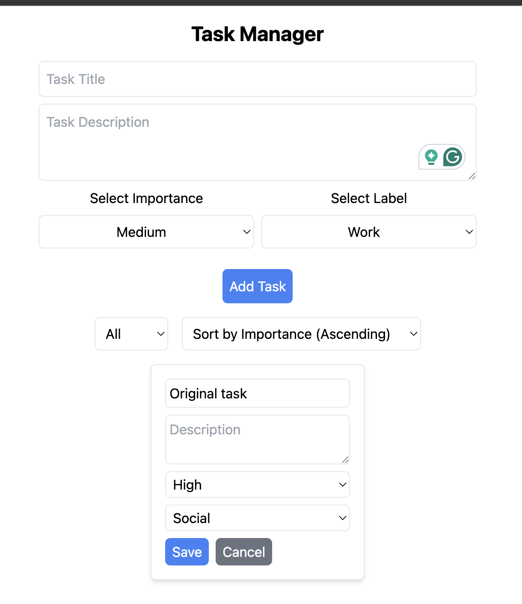
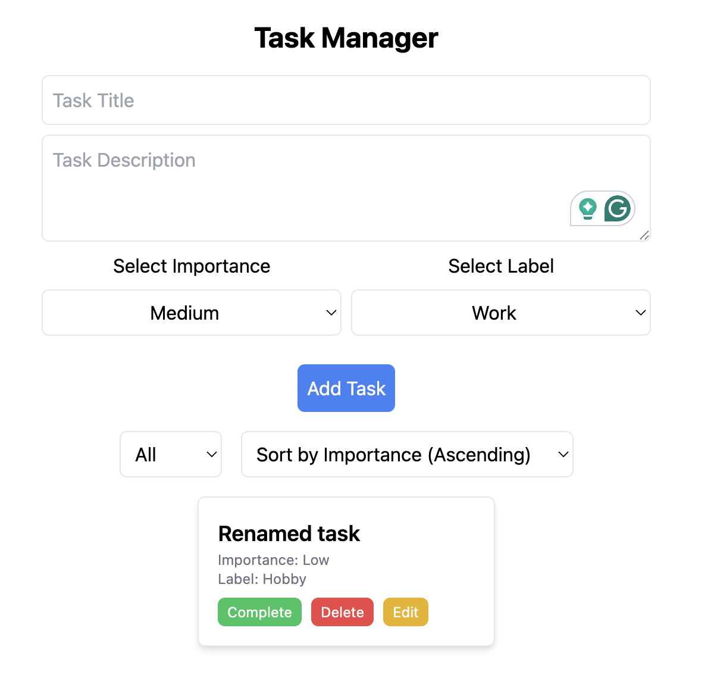
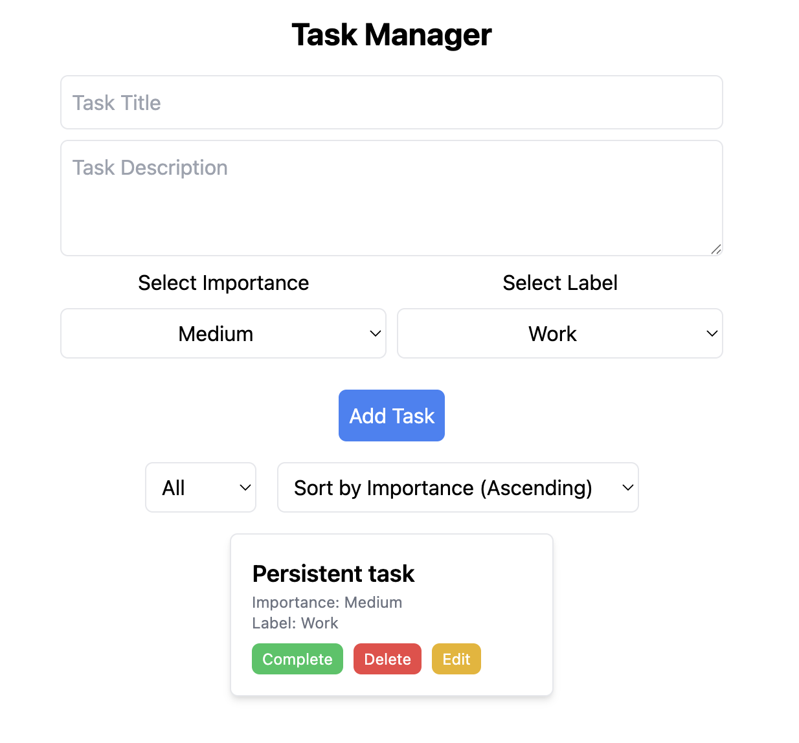
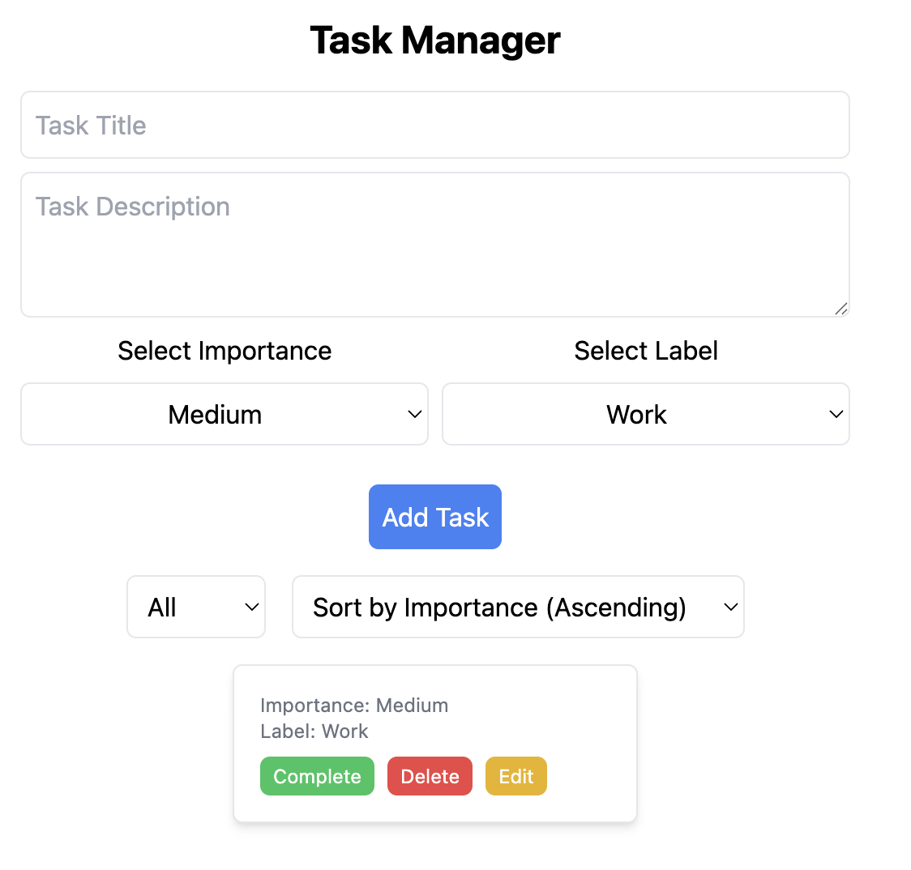
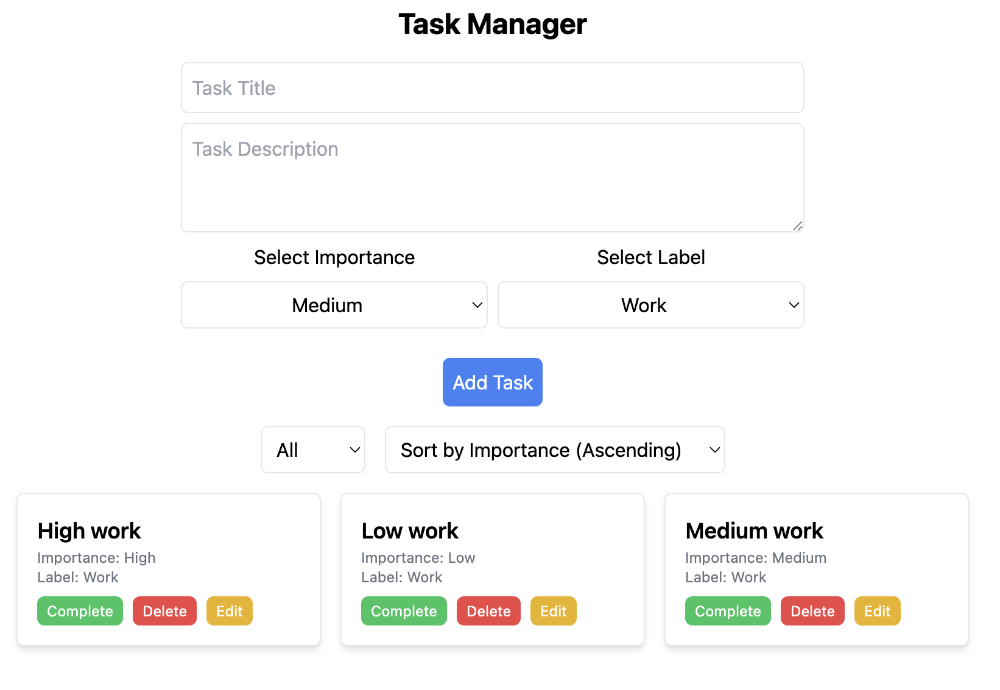

# Task Manager Bug Report

These findings are based on the current implementation and are represented by the regression tests in `tests/`. Re-run each scenario manually at `http://127.0.0.1:5173/` using a clean browser state.

## Evidence Convention

Screenshots are required evidence; videos are optional. Store manual evidence under `bug-evidence/` using the bug ID in every filename. Use the existing screenshot names referenced below and add the matching optional video when useful.

For `BUG-001`, capture two screenshots: one while the edit form is open showing the missing description, and one after saving the renamed task showing the lost description and reset completion state.

Do not store Playwright `test-results`, `playwright-report`, or generated visual snapshots in `bug-evidence/`. Those are automated artifacts, not manual evidence.

## BUG-001: Editing a task resets existing values

**Severity:** High

**Area:** Edit task

**Steps to reproduce:**

1. Add a task with description `Original description`, importance `High`, and label `Social`.
2. Click `Edit` on that task.
3. Observe the edit controls.
4. Change only the title and click `Save`.

**Expected:** Existing description, importance, label, and completion state remain unchanged unless explicitly edited.

**Actual:** The edit form initializes description as empty, importance as `Low`, and label as `Hobby`. Saving also sets completion to incomplete.

**Automation:** `tests/regression-edit-preserves-data.spec.ts`

**Manual evidence:** Add these screenshots after reproducing manually:

Optional video: `bug-evidence/BUG-001-edit-description.webm`

## BUG-002: Task mutations are not persisted after reload

**Severity:** High

**Area:** Persistence

**Steps to reproduce:**

1. Add a task.
2. Mark it complete.
3. Reload the page.
4. Delete the task and reload again.

**Expected:** Completion and deletion remain persisted after reload.

**Actual:** Add writes to local storage, but complete, edit, and delete update only React state. Reload can restore stale task data.

**Automation:** `tests/regression-mutations-persist.spec.ts`

**Manual evidence:**

Optional video: `bug-evidence/BUG-002-persistence.webm`

## BUG-003: Empty titles can be submitted

**Severity:** Medium

**Area:** Add task validation

**Steps to reproduce:**

1. Leave `Task Title` empty.
2. Click `Add Task`.
3. Repeat with a whitespace-only title.

**Expected:** Submission is blocked with a clear validation message and no task is created.

**Actual:** The button is only visually styled as unavailable. It remains clickable, and the submit handler does not validate or trim the title.

**Automation:** `tests/regression-rejects-empty-title.spec.ts`

**Manual evidence:**

Optional video: `bug-evidence/BUG-003-empty-title.webm`

## BUG-004: Importance sorting uses alphabetical order

**Severity:** Medium

**Area:** Filtering and sorting

**Steps to reproduce:**

1. Add a `High` Work task.
2. Add a `Low` Work task.
3. Select the Work label filter.
4. Select ascending importance sort.

**Expected:** Tasks appear in domain order: Low, Medium, High.

**Actual:** Tasks are sorted alphabetically, so High appears before Low and Medium.

**Automation:** `tests/filter-and-sort.spec.ts`

**Manual evidence:**

Optional video: `bug-evidence/BUG-004-sorting.webm`

## Exploratory follow-up

Before final submission, manually check long text, keyboard navigation, focus visibility, mobile layout, duplicate titles, malformed local storage, and color contrast. Record any additional confirmed visual or UX issues here with screenshots and reproduction steps.
